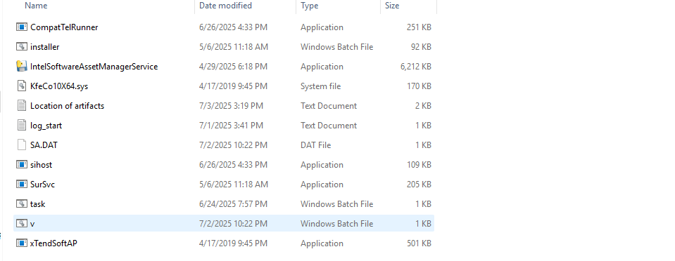

# Windows Memory Forensics & Incident Response
Live attack incident response analysis and documentation.

This repository documents a real-world attack simulation and my full investigation process - from detection to memory capture and analysis using volatility and other tools.

This is an attack I recently encountered on my personal machine and I decided to document it for reference. I also have the video proof to show I did the whole process so if you need that, please feel free to request this.

The machine is a low gaming device and as such, there are certain times AVs may need to be temporarily disabled in order to allow certain games work. I believe it was during one of such periods I unfortunately ran into a live malware attack.

CONDITIONS:
ANTI-VIRUS: OFF

WINDOWS DEFENDER: OFF

TAMPER PROTECTION: OFF

DETECTION TOOLS:
EVENT VIEWER
SYSMON
SIGMA
CHAINSAW
POWERSHELL

MEMORY DUMP TOOLS:
Volatility3
WinPmem

I always run a daily scan of my logs just to see how my machine is working behind the scenes. It was due to this that I was able to detect the stealthy malware attack a fews hours after infection (almost 12 hours).

I decided to piece together all the attack pattern and process step by step in order to reconstruct the TTP. The malware bundled a couple of trojans which I was able to detect and collage together in a folder to scan on virus total and potentially check the .exe codes in www.hybrid-analysis.com later to see how they were coded. 

