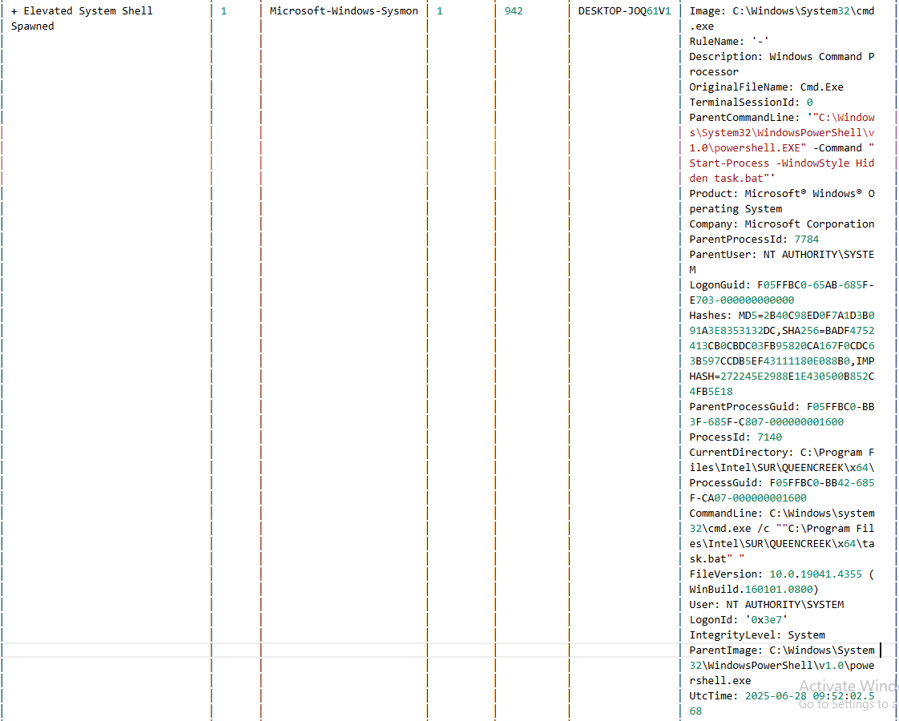
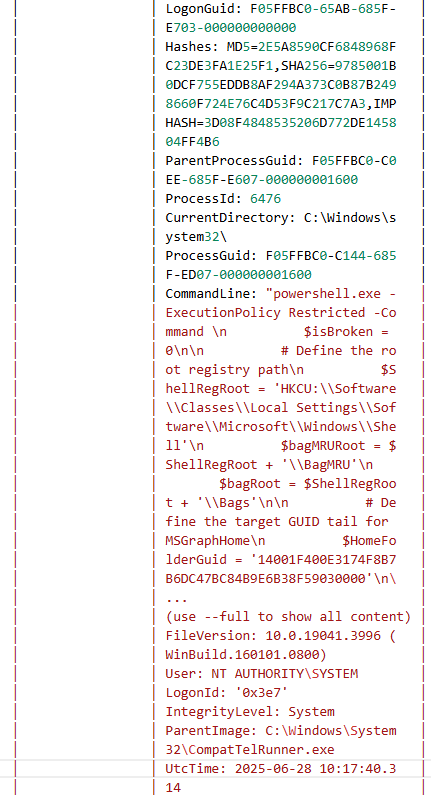
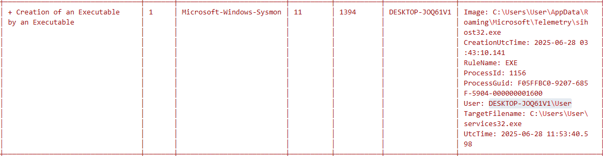
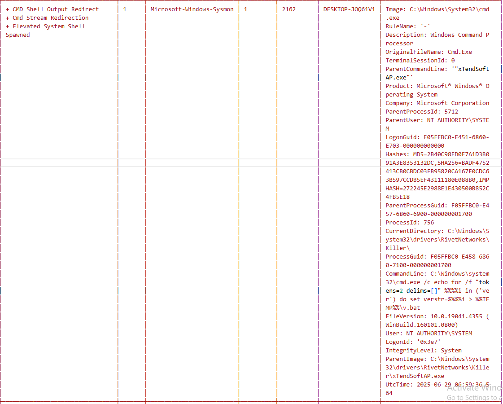
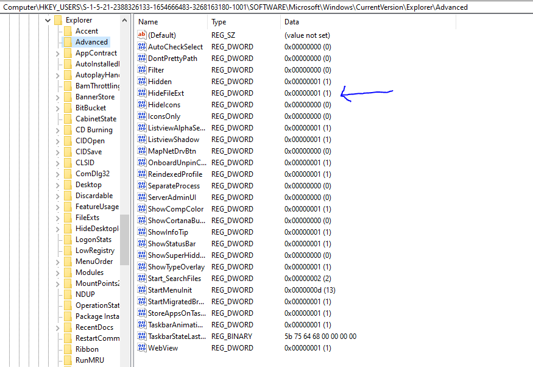

# Windows Memory Forensics & Incident Response
Live attack incident response analysis and documentation.

This repository documents a real-world attack simulation and my full investigation process - from detection to memory capture and analysis using volatility and other tools.

This is an attack I recently encountered on my personal machine and I decided to document it for reference. I also have the video proof to show I did the whole process so if you need that, please feel free to request this.

The machine is a low gaming device and as such, there are certain times AVs may need to be temporarily disabled in order to allow certain games work. I believe it was during one of such periods I unfortunately ran into a live malware attack.

CONDITIONS:
ANTI-VIRUS: OFF

WINDOWS DEFENDER: OFF

TAMPER PROTECTION: OFF

DETECTION TOOLS:
EVENT VIEWER
SYSMON
SIGMA
CHAINSAW
POWERSHELL

MEMORY DUMP TOOLS:
Volatility3
WinPmem

I always run a daily scan of my logs just to see how my machine is working behind the scenes. It was due to this that I was able to detect the stealthy malware attack a fews hours after infection (almost 12 hours).

I decided to piece together all the attack pattern and process step by step in order to reconstruct the TTP. The malware bundled a couple of trojans which I was able to detect and collage together in a folder to scan on virus total and potentially check the .exe codes in www.hybrid-analysis.com later to see how they were coded. 

I ran a clean OS install after documenting this attack as even though I believe I got all the major chain of the attack, I can't guarantee integrity of the OS anymore. Also, a clean install is always great for rock-hard defense.

This may be a long read, please bear with me. Thanks.

The following is my detection/discovery process.

1.
Name/Action: Creation of an Executable by an Executable

Starting_file/Image: C:\Users\User\AppData\Roaming\Microsoft\Telemetry\sihost32.exe

TargetFilename: C:\Users\User\services32.exe

Time: 8:31 : Date: 28\6

This were the first foreign files I encountered that were new to my scan from the previous day. The virus I downloaded dropped these files so I realized it won't be a completely fileless attack. This is a fake sihost, not the real actual shell Infrastructure host file in system32.

2.
Name/Action: Powershell Defender Exclusion

Starting_file/Image: C:\Windows\System32\cmd.exe 

ParentCommandLine: '"C:\Users\User\services32.exe"' (service32*)

ParentUser: DESKTOP-JOQ61V1\User

Hashes: MD5=2B40C98ED0F7A1D3B091A3E8353132DC,SHA256=BADF4752413CB0CBDC03FB95820CA167F0CDC63B597CCDB5EF43111180E088B0,IMPHASH=272245E2988E1E430500B852C 4FB5E18 

CommandLine: '"cmd" /c powershell -Command Add-MpPreference-ExclusionPath ''%%UserProfile%%'' & powershell -Command Add -MpPreference -ExclusionPath ''%%AppData%%'' 
& powershell -Command Add-MpPreference -ExclusionPath ''%%Temp%%'' & powershell -Command Add-MpPreference-ExclusionPath ''%%SystemRoot%%'' & exit'

User: DESKTOP-JOQ61V1\User

ParentImage: C:\Users\User\services32.exe  

Date: 28/6 : Time: 08:31

The very first command was to add a bunch of crucial folders to my defender's exclusion section (which was already turned off at the time).
UserProfile, AppData, Temp, SystemRoot were among the folders that were excluded in order for more files to be easily dropped.

3.
Name/Action: Non Interactive PowerShell Process Spawned + Powershell Defender Exclusion

Image/Starter: powershell.exe

CommandLine: powershell -Command Add-MpPreference -ExclusionPath 'C:\Users\User'

More exclusion commands. Users folder.

4.
Updated with powershell -Command Add-MpPreference -ExclusionPath 'C:\Users\User\Appdata\Roaming'

Updated with powershell -Command Add-MpPreference -ExclusionPath 'C:\USers\User\Appdata\Local\Temp'

Updated with powershell -Command Add-MpPreference -ExclusionPath 'C:\Windows'

Adding more folders to the exclusion list.

5.
Name/Action: Scheduled Task Creation via Schtasks.EXE. 
            Suspicious schtasks Schedule with High Priv.
  
Image: C:\Windows\System32\schtasks.exe

ParentCommandLine: '"C:\Windows\System32\cmd.exe" /c schtasks /create /f /sc onlogon /rl highest /tn "services32" /tr ''"C:\Users\User\services32.exe" '' & exit'
CommandLine: schtasks /create /f /sc onlogon /rl highest /tn "services32" /tr '"C:\Users\User\services32.exe"' 

User: DESKTOP-JOQ61V1\User

ParentImage: C:\Windows\System32\cmd.exe 

UtcTime: 2025-06-28 08:32:09.354 

Here, next phase of the attack was to gain elevated priv next time I restarted and log in to the machine. The command works automatically since powershell is fully enabled even at a user level.

6.
Name/Action: Elevated System Shell Spawned
             Non interactive Powershell Process Spawned
  
Image: C:\Windows\System32\WindowsPowerShell\v1.0\powershell.exe

ParentCommandLine: C:\Windows\system32\svchost.exe -k netsvc s -p -s Schedule

ParentUser: NT AUTHORITY\System

Hashes: MD5=2E5A8590CF6848968FC23DE3FA1E25F1,SHA256=9785001B0DCF755EDDB8AF294A373C0B87B2498660F724E76C4D53F9C217C7A3,IMPHASH=3D08F4848535206D772DE145804FF4B6 

CurrentDirectory: C:\Program Files\Intel\SUR\QUEENCREEK\x64\

CommandLine: '"C:\Windows\System32\WindowsPowerShell\v1.0\powershell.EXE" -Command "Start-Process -WindowStyle Hidden task.bat"' 

User: NT AUTHORITY\SYSTEM

ParentImage: C:\Windows\System32\svchost.exe

UtcTime: 2025-06-28 09:51:59.312

Boom! I had restarted here and they automatically gain System level access and immediately a task.bat file was dropped and now being called to action.

7.
Name/Action: Elevated System Shell Spawned

Image: C:\Windows\System32\cmd.exe

ParentCommandLine: '"C:\Windows\System32\WindowsPowerShell\v1.0\powershell.EXE" -Command " Start-Process -WindowStyle Hidden task.bat"' 

ParentUser: NT AUTHORITY\SYSTEM

Hashes: MD5=2B40C98ED0F7A1D3B091A3E8353132DC,SHA256=BADF4752413CB0CBDC03FB95820CA167F0CDC63B597CCDB5EF43111180E088B0,IMPHASH=272245E2988E1E430500B852C4FB5E18 

CurrentDirectory: C:\Program Files\Intel\SUR\QUEENCREEK\x64\

CommandLine: C:\Windows\system32\cmd.exe /c ""C:\Program Files\Intel\SUR\QUEENCREEK\x64\task.bat" " 

User: NT AUTHORITY\SYSTEM

ParentImage: C:\Windows\System32\WindowsPowerShell\v1.0\powershell.exe  

UtcTime: 2025-06-28 09:52:02.568

Here is a suppressed running of task.bat which was making some registry modifications.

8.
Name/Action: Elevated System Shell Spawned

Image: C:\Windows\System32\WindowsPowerShell\v1.0\powershell.exe

ParentCommandLine: C:\Windows\system32\CompatTelRunner.exe - m:appraiser.dll -f:DoScheduled TelemetryRun -cv:0ATCS90vQk65SpDv.1 

Hashes: MD5=2E5A8590CF6848968FC23DE3FA1E25F1,SHA256=9785001B0DCF755EDDB8AF294A373C0B87B2498660F724E76C4D53F9C217C7A3,IMP HASH=3D08F4848535206D772DE145804FF4B6

CurrentDirectory: C:\Windows\system32\

CommandLine: "powershell.exe - ExecutionPolicy Restricted -Command \n $isBroken = 0\n\n # Define the root registry path\n $ShellRegRoot = 'HKCU:\\Software
\\Classes\\Local Settings\\Software\\Microsoft\\Windows\\Shell'\n $bagMRURoot = $ShellRegRoot + '\\BagMRU'\n $bagRoot = $ShellRegRoo t + '\\Bags'\n\n # Define the target GUID tail for MSGraphHome\n $HomeFolderGuid = '14001F400E3174F8B7B6DC47BC84B9E6B38F59030000'\n\ ... (use --full to show all content) 

User: NT AUTHORITY\SYSTEM

ParentImage: C:\Windows\System32\CompatTelRunner.exe

UtcTime: 2025-06-28 10:17:40.314

Areas Targetted -
$ShellregRoot = 'HKCU:\Software\Classes\Local Settings\Software\Microsoft\Windows\Shell'

$bagMRURoot = $ShellRegRoot + '\BagMRU'

$bagRoot = $ShellRegRoot + '\Bags'

Attack is targetting windows shell registry bags(stores folder view settings).

Usually used for:

    a. persistence (Explorer will load malicious configs)
    
    b. Lateral movement (storing encrypted payloads in registry values)

Potential Incident:

Modifying registry bags BagMRU/Bags key could mean:

a. COM hijacking: Explorer loads malicious CLSIDs

b. Rogue shell extension

c. Hidden data storage

This section is what made me decide a clean install is totally necessary haha. I have since started to read up on BagMRU and Bags.

9.
Name/Action: Elevated powershell spawned

Image: Powershell

ParentCommandLine:  C:\Windows\system32\CompatTelRunner.exe - m:appraiser.dll -f:DoScheduled TelemetryRun -cv:0ATCS90vQk65SpDv.1

ParentUser: NT AUTHORITY\SYSTEM

Hashes: MD5=2E5A8590CF6848968FC23DE3FA1E25F1,SHA256=9785001B0DCF755EDDB8AF294A373C0B87B2498660F724E76C4D53F9C217C7A3,IMPHASH=3D08F4848535206D772DE145804FF4B6

CommandLine: 'powershell.exe - ExecutionPolicy Restricted -Command Write-Host ''Final result: 1'';'

ParentImage: C:\Windows\System32\CompatTelRunner.exe

UtcTime: 2025-06-28 10:17:45

CompatTelRunner is a legit Intel file but I believe it was being dll sideloaded here and windows can't tell since its supposed to work as normal. Sneaky.

10.
Name/Action: Disable Windows Defender Functionalities Via registry key

Image: C:\ProgramData\Microsoft\Windows Defender\platform\4.18.25050.5-0\MsMpEng.exe

TargetObject: HKLM\SOFTWARE\Microsoft\Windows Defender\Real-Time Protection\DisableRealtimeMonitoring 

RuleName: T1089,Tamper-Defender   

User: NT AUTHORITY\SYSTEM

Attempt to completely turn off defender. 

11.
Name/Action: Creation of an Executable by an Executable

image: sihost32

TargetFileName: services32

User: DESKTOP-JOQ61V1\User

Running services32

12.
Tried to repeat steps 2, 3, 4

13.
Attempt repeat of step 5.

Scheduling services32 to run on log on.

14. 
Name/Action: CMD Shell Output Redirect
             Cmd Stream Redirection
             Elevated System Shell spawned
    
image: cmd.exe

ParentCommandLine: '"C:\Program Files\Intel\SUR\QUEENCREEK\SurSvc.exe"' 

(#introduction to SurSvc.exe after it's been dropped by sihost32 or services32.)

ParentUser: NT AUTHORITY\System

Hashes: MD5=2B40C98ED0F7A1D3B091A3E8353132DC,SHA256=BADF4752413CB0CBDC03FB95820CA167F0CDC63B597CCDB5EF43111180E088B0,IMPHASH=272245E2988E1E430500B852C4FB5E18 

CommandLine: '"C:\Windows\system32\cmd.exe" /C ""C:\Program Files\Intel\SUR\QUEENCREEK\x64\installer.bat" X T > "C:\ProgramFiles\Intel\SUR\QUEENCREEK\x64\log_start.txt" 2>&1"'

(introduction to installer.bat, log_start.txt)

ParentImage: C:\Program Files\Intel\SUR\QUEENCREEK\SurSvc.exe 

15.
Name/Action: Elevated shell

image: powershell

 ParentCommandLine: '"C:\Program Files\Intel\SUR\QUEENCREEK\x64\esrv_svc.exe" "--AUTO_START" "--start" "--start_options_registry_key" "HKEY_LOCAL_MACHINE\SYSTEM\CurrentControlSet\services\ESRV_SVC_QUEENCREEK\_start"'
CommandLine: '"C:\\Windows\\system32\\WindowsPowerShell\\v1.0\\powershell.exe" Get-CimInstance -Class Win32_DiskPartition | Select-Object BootPartition, DiskIndex, Size | ForEach-Object { $_.PSObject.Properties ForEach-Object { ''{0}:{1}'' -f $_.Name, $_.Value } }'

ParentImage: C:\Program Files\Intel\SUR\QUEENCREEK\x64\esrv_svc.exe

Disk + environment query.

16 
Elevated shell

image: powershell

 ParentCommandLine: '"C:\Program Files\Intel\SUR\QUEENCREEK\x64\esrv_svc.exe" "--AUTO_START" "--start" "--start_options_registry_key" "HKEY_LOCAL_MACHINE\SYSTEM\CurrentControlSet\services\ESRV_SVC_QUEENCREEK\_start"'
CommandLine: '"C:\\Windows\\system32\\WindowsPowerShell\\v1.0\\powershell.exe" Get-CimInstance -Class Win32_PhysicalMemory | Select-Object Capacity, Caption, Manufacturer, PartNumber, SMBIOSMemoryType, Speed |ForEach-Object { $_.PSObject.Properties | ForEach-Object { ''{0}:{1}'' -f $_.Name, $_.Value } }'

More disk + environment query

ParentImage: C:\Program Files\Intel\SUR\QUEENCREEK\x64\esrv_svc.exe  

17.
CommandLine: '"C:\\Windows\\system32\\WindowsPowerShell\\v1.0\\powershell.exe" Get-CimInstance -Class Win32_DiskDrive | Select-Object Caption, FirmwareRevision, Index, InterfaceType, MediaType, Model, PNPDeviceID, Status | ForEach-Object {$_.PSObject.Properties | ForEach-Object { ''{0}:{1}'' -f $_.Name, $_.Value } }'

18.
CommandLine: '"C:\\Windows\\system32\\WindowsPowerShell\\v1.0\\powershell.exe" Get-CimInstance -Class Win32_DiskDrive | Select-Object Caption, Status | ForEach-Object { $_.PSObject.Properties | ForEach-Object { ''{0}:{1}'' -f $_.Name, $_.Value } }'

CommandLine: '"C:\\Windows\\system32\\WindowsPowerShell\\v1.0\\powershell.exe" Get-CimInstance -Class Win32_BaseBoard | Select-Object Manufacturer, Product, Version | ForEach-Object { $_.PSObject.Properties | ForEach-Object { ''{0}:{1}'' -f $_.Name, $_.Value } }'

Just checking system environment at this point.

19.
Elevated shell spawned

Image: C:\Windows\SysWOW64\cmd.exe 

ParentCommandLine: '"C:\Program Files\Intel\SUR\QUEENCREEK\Updater\bin\IntelSoftwareAssetManagerService.exe"' 

(Introduction to IntelSoftwareAssetManagerService.exe)

Hashes: MD5=D966DBA31D7B62CAD2DECAE92C5A8D12,SHA256=36FFFAB256A48C6FB76A4D1199193195E7707E9019414AC87572C3DBC810BC6C,IMPHASH=392B4D61B1D1DADC1F06444DF258188A

User: NT AUTHORITY\SYSTEM

IntegrityLevel: System

ParentImage: C:\Program Files\Intel\SUR\QUEENCREEK\Updater\bin\IntelSoftwareAssetManagerService.exe

UtcTime: 2025-06-28 22:26:32.951  

20.
Elevated system shell

image: powershell

Starting Schedule to restart task.bat

21. 
Successfully created a schedule task.

TargetFileName: C:\Windows\Tasks\SA.Dat

(introduction to SA.DAT)

22.
New foreign artifact detected.

xTendsoftAP.EXE

xTendSoftAP seems to be a legit system file but attacker seem to be using it to do their bidding.

LOLbin - living off the land style.

Potential dll sideloading / hijacked binary.

23. 
xTendSoftAP gets to work, right away.

Here it is running some command.

Command is for query of environment. Getting windows versions either to make:

1. Malware auto adjust?
2. Determine if not within a virtual environment.

(introduction to v.bat)

The pattern is quite clear now, due to the schedule set, each time I restart/logon,

it tries to exclude some folders

It tries to gain NT AUTH access.

It's a loop.

Some folders were deleted from my external USB but I believe the malware was just waiting for more commands from the bot master. Waiting to establish C2 server.

24.
Attempt to hide file extension/rename to bypass detection.

25.
Successfully hiding files display.

Using registry address.

26 

Main stager, AgentTesla

Sihost in process

So far primarily I have used sysmon + sigmas + chainsaw to detect all these behaviors. I planned to wipe the OS and do a clean install but I used winPmem to dump the memory of the previous OS just to do a deeper dive and see some other things I missed.

chainsaw

sihost discovery in event viewer

Fake svchost.exe masquerade

Defender spotting trojans.

ESVR service being abused for dll sideloading

All files dropped are gathered for studying and uploading to virus total.

## Reflections from attack

Please see [LEARNED.md](LEARNED.md) for lessons learned during this response.

## Memory forensics delay

I dumped the memory of the previous OS in order to run deep analysis using volatility but for some reason, it would appear I am running into some dependencies issues probably due to windows 11. I'm not sure. I also tried to use rekall but I am having threat detetction

issues there. I am still working on setting up that aspect of my lab but for now I have been reading about how to use those memory forensic tools to :

a. Detect malicious processes (via pslist, malfind)

b. Analyze command line execution (cmdline)

c. Scan for network connections (netscan)

I am researching alternatives to volatility in the mean time that I can use till I'm able to figure out the compatibility issseus,
